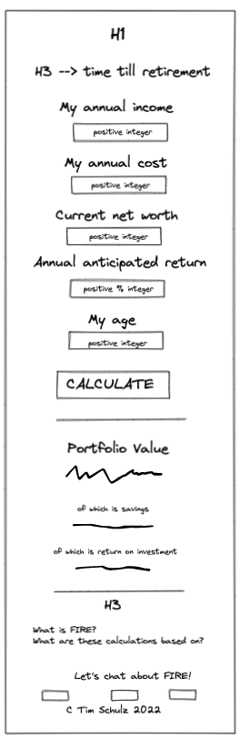

# F.I.R.E. Calculator - [Live link](https://timschulz1991.github.io/js-essentials-portfolio-project-fire-calculator/)

This fully-responsive calculation tool helps people, who are interested in FIRE (Financial Independence, Retire Early) to determine how much longer they still have to work and save money until they can live financially independent. This means that they can live off the returns of their investments for the rest of their lives. This page not only helps people with their FIRE-related calculations, but also gives them an introduction to the FIRE movement overall. 

The tool is easy to use, so that anyone can calculate their potential future retirement age with only a handful of values and get excited about the prospects of this (in case the results are exciting, that is).


## User Experience (UX)
- ### User Stories
    #### Visitor Goals
    - As a visitor, I want to be able to calculate my potential retirement age based on the values I insert into the calculator; I also want to know how many years are left to get there.
    - As a visitor, I want to see my total future portfolio value, and how much of it is savings and how much is return on my investment (to see the miracle of compound interest in action).
    - As a visitor, I want to learn more about the FIRE movement and how the calculations are done.
    - As a visitor, I might want to get in touch with the creator of this page and talk more about FIRE.

- ### Design
    #### Color Scheme
    - The main colors used on the page are a light gray, a shade of red and a shade of blue, in order to keep the color palette simple and fitting for this purpose.

    #### Typography
    - A complimentary font pair was used - "Arvo" with a fallback of serif for the headlines, and "Lato" with a fallback of sans-serif for the rest of the body.

    #### Imagery
    - As a hero image, an image of Wall Street in New York was used (downloaded from [Unsplash.com](https://unsplash.com/)). The other only picture used was a picture of the developer of this website.

- ### Wireframes
    - The following wireframe shows the general outline of the page as it was intended. The only real difference in the final page is that I made the FAQ more prominent than I had originally thought. 
    
    

## Features
In the following section, I will give a brief overview of all the features of the page. All of them are responsive on all device sizes.

- ### Header and calculator input
    - The header does not require any navigation section, as the page has only one main feature and a FAQ section; the websites logo is shown in the center of the header.
    - The input section of the calculator asks for 5 different values that are needed to calculate the future retirement age: current income, current costs, current net worth, anticipated return of the market and your current age.
    - When the values were entered correctly, the output section will appear and you will already see your future retirement age in the headline of the input section (and how long it will take you to get there).
    - If an error was made in the input section (i.e. an invalid value was entered), this section will show warnings and how to fix the error(s).
    

- ### Calculator output
    - The output section of the calculator only appears after the input values have been validated successfully. It shows the calculated future retirement age, the total future portfolio value and how much of that contitutes savings and how much return on investment. 
    - This section also allows you to send the results to yourself via email. 


- ### FAQ section
    - This section answers the most relevant questions: What is the FIRE movement and how is the calculation of the future retirement age done? Furthermore, the visitor can learn more about the developer of the page in this section.
    - While the "cards" in this section have a rotation effect on desktop, they are static cards on mobile.
    

- ### Footer
    - In the footer section, website visitors can get in touch with the developer and talk more about FIRE, either via Facebook, Instagram or mail. 
    

### Features left to implement
- In the future I would like to implement a graph/diagram that shows how the portfolio is growing over time until financial independence is reached.


## ## Technologies Used
### Languages Used

- [HTML5](https://en.wikipedia.org/wiki/HTML5)
- [CSS3](https://en.wikipedia.org/wiki/Cascading_Style_Sheets)
- [JavaScript](https://en.wikipedia.org/wiki/JavaScript)

### Frameworks, Libraries, Websites & Programs Used
1. [Google Fonts](https://fonts.google.com/)
    - Google fonts was used to import the 'Arvo' and 'Lato' fonts into the style.css file.
2. [Font Awesome](https://fontawesome.com/)
    - Font Awesome was used in the footer section of the website to add icons for aesthetic and UX purposes.
3. [Git](https://git-scm.com/)
    - Git was used for version control by utilizing the Gitpod terminal to commit to Git and Push to GitHub.
4. [GitHub](https://github.com/)
    - GitHub is used to store the projects code after being pushed from Git.
5. [Excalidraw](https://excalidraw.com/)
    - Excalidraw was used to create the wireframe for this project.
6. [tinypng.com](https://tinypng.com/)
    - This website was used to decrease the file size of images.
7. [reliablepsd.com/](https://reliablepsd.com/ultimate-google-font-pairings/)
    - This website was used to find a suitable font pair.
8. [html-css-js.com](https://html-css-js.com/css/generator/box-shadow/)
    - This website was used to generate CSS code for shadows throughout the page.
9. [grid.malven.co/](https://grid.malven.co/)
    - This website was used to get help with different CSS grid properties for my input section.
10. [mycolor.space/](https://mycolor.space/)
    - This website was used to find complimentary colors.
11. [unsplash.com/](https://unsplash.com/)
    - This website was used to find a suitable hero image.
12. [www.favicon.cc/](https://www.favicon.cc/)
    - This website was used to generate a suitable favicon.
13. [www.emailjs.com/](https://www.emailjs.com/)
    - EmailJS was used to offer the visitor to send the results of the calculator directly to the visitor's email.


## Testing

### Validator Testing

The W3C Markup Validator, W3C CSS Validator Services, and  were used to validate the project to ensure there were no syntax errors in the project.

- HTML
    - No errors were found when passing through the official [W3C Markup Validator](https://validator.w3.org/) - [Results](https://validator.w3.org/nu/?doc=https%3A%2F%2Ftimschulz1991.github.io%2Fjs-essentials-portfolio-project-fire-calculator%2F)
- CSS
    - No errors were found when passing through the official [W3C CSS Validator](https://jigsaw.w3.org/css-validator/) - [Results](https://jigsaw.w3.org/css-validator/validator?uri=https%3A%2F%2Ftimschulz1991.github.io%2Fjs-essentials-portfolio-project-fire-calculator%2F&profile=css3svg&usermedium=all&warning=1&vextwarning=&lang=de)
- JavaScript
    - No errors were found when passing through the official [Jshint validator](https://jshint.com/)
    - The following metrics were returned: 
        - There are 9 functions in this file.
        - Function with the largest signature take 5 arguments, while the median is 1.
        - Largest function has 27 statements in it, while the median is 3.
        - The most complex function has a cyclomatic complexity value of 12 while the median is 2.

### Feature Testing
- The input area has been tested extensively with all kinds of (allowed) input values.
- A JS validation process incl. error output to the user makes sure that only valid values can be entered; further information is provided to the user about what values they can use (below the calculation button).
- The output section below the calculation button is hidden at first, and will always be hidden (again) when the user has entered invalid values.
- The email is sent, when a valid email address was provided and the button is clicked; the email content is working as intended.
- The FAQ cards are having a rotation effect only on large screens and laptops.
- The Footer links lead to the correct place and open in a new tab.

### Further Testing
- The website was tested on Google Chrome, Opera, Firefox and Safari browsers.
- The website was viewed on a variety of devices such as Desktop, MacBook Pro, iPhone 8, iPhone 12 and iPad Air 2020.
- The responsiveness of all screen sizes was tested thoroughly on the actual devices (not only in the Chrome Development Tools).
- A large amount of testing was done to ensure that all the links, buttons, input fields and rotation effects work correctly.
- Friends and family members (with design and programming backgrounds) were asked to review the site and documentation to point out any bugs and/or user experience issues. A couple of changes were implemented after that feedback (e.g. the input fields and the calculation process was described more thoroughly for the user). 

### Accessibility 

- The accessibility score which was calculated with the Lighthouse tool within the Chrome Developer tools shows that the website is highly accessible for screen readers.
- The performance score can vary heavily, depending on which computer was used for testing (I tested on several devices and this was the best score I got).


## Deployment
### GitHub Pages

The project was deployed to GitHub Pages using the following steps:

1. Log in to GitHub and locate the correct [GitHub Repository](https://github.com/TimSchulz1991/js-essentials-portfolio-project-fire-calculator)
2. At the top of the Repository (not top of page), locate the "Settings" Button on the menu.
3. Click on the Pages tab in the bottom of the navigation bar on the left.
4. Under "Source", click the dropdown called "None" and select "main".
5. Click on save and a link for the website will be created (with a blue background).
6. After a few minutes the background will turn green and the project [link](https://timschulz1991.github.io/js-essentials-portfolio-project-fire-calculator/) is now published and ready to view on any browser/device.

### Forking the GitHub Repository

By forking the GitHub Repository we make a copy of the original repository on our GitHub account to view and/or make changes without affecting the original repository by using the following steps...

1. Log in to GitHub and locate the [GitHub Repository](https://github.com/)
2. At the top of the Repository (not top of page) just above the "Settings" Button on the menu, locate the "Fork" Button.
3. You should now have a copy of the original repository in your GitHub account.

### Making a Local Clone

1. Log in to GitHub and locate the [GitHub Repository](https://github.com/)
2. Under the repository name, click "Clone or download".
3. To clone the repository using HTTPS, under "Clone with HTTPS", copy the link.
4. Open Git Bash
5. Change the current working directory to the location where you want the cloned directory to be made.
6. Type `git clone`, and then paste the URL you copied in Step 3.

```
$ git clone https://github.com/YOUR-USERNAME/YOUR-REPOSITORY
```

7. Press Enter. Your local clone will be created.

```
$ git clone https://github.com/YOUR-USERNAME/YOUR-REPOSITORY
> Cloning into `CI-Clone`...
> remote: Counting objects: 10, done.
> remote: Compressing objects: 100% (8/8), done.
> remove: Total 10 (delta 1), reused 10 (delta 1)
> Unpacking objects: 100% (10/10), done.
```

Click [Here](https://help.github.com/en/github/creating-cloning-and-archiving-repositories/cloning-a-repository#cloning-a-repository-to-github-desktop) to retrieve pictures for some of the buttons and more detailed explanations of the above process.


## Credits
### Code
- [This](https://www.youtube.com/watch?v=x7Ewtay0Q78&ab_channel=CodewithVoran) Youtube video taught me how to implement EmailJS in order to send emails to my website visors.
- [This](https://www.w3schools.com/howto/howto_css_flip_card.asp) W3Schools article taught me how to create flip cards (cards with a rotation effect) in CSS.
- My mentor Antonio helped me a lot with the implmentation of a "hidden" class, which hides sections of the page at first. He also motivated me to include the EmailJS feature.
- My startup colleague Daniel helped me with advice on how to refactor my code for less "DRY" and a better readability and structure overall. Thank you for listening to all my questions!
- If any coding help/inspiration that I used in the project is not mentioned here, it was referenced as a comment in the code. 

### Content

- External content about the general stock market, about the FIRE movement and about the 4% rule was linked to within the website, so visitors can read more. The rest of the content and the logic behind the calculations was written by the developer, based on generally available investment formulas regarding the Future Value of an investment.
- Those external websites are: 
    - [Average Stock Market Returns](https://www.sofi.com/learn/content/average-stock-market-return/)
    - [The FIRE Movement](https://www.investopedia.com/terms/f/financial-independence-retire-early-fire.asp)
    - [The 4% Rule](https://www.investopedia.com/terms/f/four-percent-rule.asp)

### Media

- The hero image was downloaded from [unsplash.com](http://unsplash.com).

### Acknowledgements

- As described above, big acknowledgements to my mentor Antonio and my colleague Daniel for all the help and feedback.


Thank you for reading my README!

